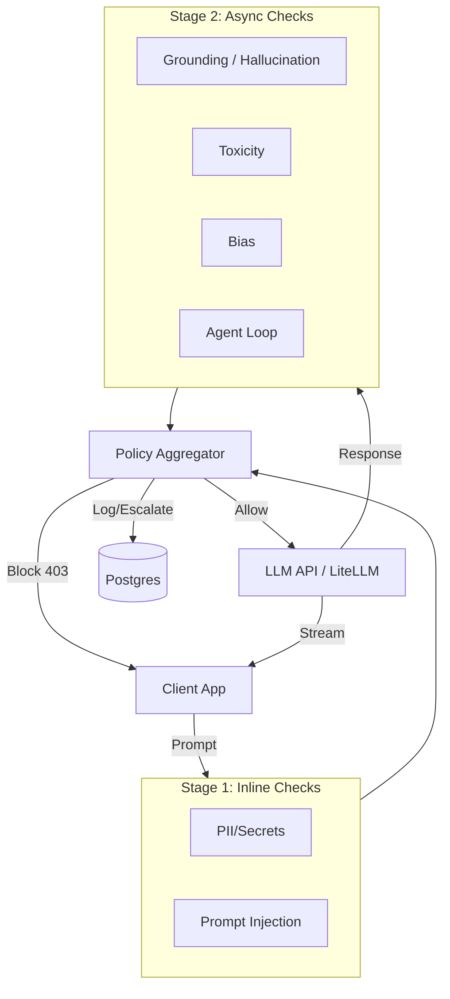

<p align="center">
  
  
  
  
</p>

# ControlPlane.ai — Real-Time AI Runtime Policy Engine

> **A blazing-fast, configurable proxy that sits between your application and any LLM to enforce security, safety, and governance policies in real time without compromising latency.**

---

## Table of Contents

- [Problem Statement](#problem-statement)
- [Solution Overview](#solution-overview)
- [Key Features](#key-features)
- [Architecture](#architecture)
- [Tech Stack](#tech-stack)
- [Check Pipeline](#check-pipeline)
- [Project Structure](#project-structure)
- [Getting Started](#getting-started)
- [Environment Variables](#environment-variables)
- [API Endpoints](#api-endpoints)
- [Demo Scenarios](#demo-scenarios)
- [Future Scope](#future-scope)

---

## Problem Statement

As AI agents and LLM applications move into production, organizations face critical risks:
- **Security**: Prompt injection and extraction of system prompts.
- **Privacy**: Unintentional leakage of PII, API keys, or credentials.
- **Quality**: Hallucinations and ungrounded responses.
- **Cost**: Runaway agent loops consuming massive API budgets.
- **Safety**: Toxic or biased outputs damaging brand reputation.

Most "AI oversight" projects just offer detection. **ControlPlane.ai offers governance**—allowing dynamic, per-organization and per-use-case policies that actively block or escalate violations in real time.

---

## Solution Overview

ControlPlane.ai acts as a reverse proxy between clients and LLMs, enforcing configurable policies across three stages:

1. **Accepts** the incoming chat request.
2. **Evaluates Stage 1 (Inline)**: Runs lightning-fast regex checks for PII and Prompt Injection (<1ms) on the prompt. If failed, it instantly blocks the request (403).
3. **Routes via LiteLLM**: If allowed, forwards the request to the live LLM (or mock backend).
4. **Evaluates Stage 2 (Async)**: While the response streams back, it runs deeper ML-based checks on the response text (Grounding, Toxicity, Bias, Loop Detection).
5. **Aggregates Decisions**: The Policy Aggregator reads per-org rules from Postgres to decide if a violation should result in a BLOCK or ESCALATE.
6. **Logs & Audits**: Persists all interactions, latencies, and flags asynchronously for the dashboard.



---

## Key Features

| Feature | Description |
|---|---|
| **Multi-Stage Policy Engine** | Ultra-fast Stage 1 (<1ms) for prompt safety; thorough Stage 2 (<400ms) for response quality, grounding, and bias. |
| **Org & Use-Case Routing** | Dynamically apply different thresholds and actions (BLOCK vs ESCALATE) based on the specific organization and use case (e.g. `customer_support_bot` vs `internal_knowledge_assistant`). |
| **Agent Loop Prevention** | Stateful tracking of tool calls to detect and block runaway agents before they drain your API budget. |
| **Local, Private Models** | Uses lightweight local models (`all-MiniLM-L6-v2` for grounding, `toxic-bert` for toxicity, `distilbert-mnli` for bias) running locally—no third-party data sharing. |
| **Universal LLM Support** | Powered by LiteLLM, supporting OpenAI, Anthropic, Groq, Gemini, and more, plus a highly configurable mock mode for predictable demos. |
| **Live Audit Dashboard** | React 19 + TanStack Start UI providing real-time visibility into traffic, policy violations, and trust metrics. |

---

## Architecture

ControlPlane.ai is built for speed and reliability:

- **FastAPI Backend**: Handles high-concurrency requests with background tasks for non-blocking database logging.
- **Policy Aggregator**: A single routing engine that reads configuration from Postgres (cached in Redis with 30s TTL) to make ALLOW/BLOCK/ESCALATE decisions.
- **ML Pipeline**: Sentence-transformers and ML pipelines are pre-loaded and run on CPU/GPU without blocking the main event loop.
- **TanStack Start Frontend**: A modern, reactive dashboard that polls the backend for live interactions and policy management.

---

## Tech Stack

### Backend (Proxy)
| Technology | Purpose |
|---|---|
| **FastAPI** | High-performance async API server |
| **SQLAlchemy + asyncpg** | Async ORM and PostgreSQL driver |
| **LiteLLM** | Universal router for LLM provider APIs |
| **Redis** | Policy caching and stateful loop counting |
| **PyTorch** | Local ML models for grounding, toxicity, and bias |

### Frontend (Dashboard)
| Technology | Purpose |
|---|---|
| **React 19** | Component-based UI framework |
| **TanStack Start & Router** | SSR, routing, and data fetching |
| **Tailwind CSS v4** | Utility-first styling |
| **Vite 8** | Lightning-fast dev server and bundler |

---

## Check Pipeline

### Stage 1 (Inline — <1ms)
- **PII & Secrets**: Regex and Luhn algorithm checks for API keys, SSNs, Credit Cards, Emails, and Phone Numbers.
- **Prompt Injection**: Detects jailbreaks (DAN), role overrides, and system prompt extraction attempts.

### Stage 2 (Async — < 400ms)
- **Grounding (Hallucination)**: Uses `all-MiniLM-L6-v2` to compute cosine similarity between the RAG context and the generated response. Flags claims falling below the configurable threshold.
- **Toxicity**: Uses `toxic-bert` to flag harmful or violent content.
- **Bias**: Uses `distilbert-base-uncased-mnli` for zero-shot classification of biased language.
- **Agent Loop**: Hashes tool calls and tracks frequencies in Redis to prevent infinite agent execution loops.

---

## Project Structure

```text
ControlPlane.ai/
├── frontend/          # React 19 + TanStack Start + Tailwind v4
│   ├── src/
│   │   ├── routes/    # Dashboard pages (monitor, audit, policy, trust)
│   │   ├── components/# Reusable UI components
│   │   └── lib/       # API clients and utils
│   ├── vite.config.ts
│   └── package.json
├── proxy/             # FastAPI backend application
│   ├── main.py        # API routing and interaction logic
│   ├── llm_router.py  # LiteLLM integration (live + mock)
│   ├── config.py      # Environment configurations
│   └── cache.py       # Redis caching layer
├── policy/            # Core policy engine
│   ├── aggregator.py  # Central decision router (ALLOW/BLOCK/ESCALATE)
│   └── manager.py     # Policy configuration and defaults
├── checks/            # Individual evaluation modules
│   ├── stage1_pii.py
│   ├── stage1_injection.py
│   ├── stage2_grounding.py
│   ├── stage2_loop.py
│   ├── stage2_toxicity.py
│   └── stage2_bias.py
├── db/                # SQLAlchemy models and base
├── alembic/           # Database migrations
├── mocks/             # Content-aware mock scenarios for testing
└── tests/             # Golden test sets and latency benchmarks
```

---

## Getting Started

### Prerequisites
- **Node.js** ≥ 18.x
- **Python** ≥ 3.10
- **PostgreSQL** database
- **Redis** server

### 1. Backend Setup

```bash
# Configure environment variables
cp .env.example .env

# Create and activate virtual environment
python -m venv .venv
source .venv/bin/activate  # On Windows: .\.venv\Scripts\Activate.ps1

# Install dependencies
pip install -r requirements.txt

# Start the proxy server (runs on port 8000)
uvicorn proxy.main:app --reload --port 8000
```

### 2. Frontend Setup

```bash
cd frontend

# Install dependencies
npm install

# Start the dev server (runs on port 3000)
npm run dev
```

---

## Environment Variables

Configure your `.env` file in the root directory:

```env
# Application
APP_ENV=development
LOG_LEVEL=INFO

# LLM Backend: "mock" (uses fixtures) or "live" (calls real models)
LLM_BACKEND=mock
# LLM_MODEL=gpt-4o-mini

# API Keys (Required for live mode)
# OPENAI_API_KEY=sk-...
# ANTHROPIC_API_KEY=sk-ant-...
# GROQ_API_KEY=...
# GEMINI_API_KEY=...

# Database (Postgres)
POSTGRES_HOST=localhost
POSTGRES_PORT=5432
POSTGRES_USER=controlplane
POSTGRES_PASSWORD=controlplane
POSTGRES_DB=controlplane
# Or use DATABASE_URL for hosted DBs

# Cache (Redis)
REDIS_HOST=localhost
REDIS_PORT=6379

# Models
EMBEDDING_MODEL=all-MiniLM-L6-v2
```

---

## API Endpoints

### Chat Proxy
- `POST /v1/chat` : Main proxy endpoint. Expects `prompt`, `rag_context`, and optional `agent_id` or `messages`. Evaluates policies, calls LLM, and returns the response with check latencies and flags.
- `POST /v1/evaluate` : Pure evaluation endpoint to check an existing `prompt` and `ai_response` without generating a new completion.

### Policy Management
- `GET /policy/config/{org_id}/{use_case}` : Retrieve the active policy.
- `POST /policy/config` : Create or update an org's policy configuration.

### Audit & Telemetry
- `GET /v1/interactions` : Fetch interaction history.
- `GET /v1/flags` : Fetch policy violation flags.
- `GET /v1/trust/metrics` : Fetch aggregated metrics (FPR, precision, recall) for the dashboard.
- `GET /health` : Backend health check.

---

## Demo Scenarios

ControlPlane.ai includes a built-in scenario runner to demonstrate its capabilities. Use `demo_runner.py` to simulate traffic:

| # | Name | Pillar | What happens |
|---|---|---|---|
| 1 | **The Confident Hallucination** | Performance | Stage 2 detects claims absent from RAG context. |
| 2 | **The Runaway Agent** | Cost | Stage 2 blocks the 4th identical tool call from an agent. |
| 3 | **The Subtle Leak** | Responsibility | Stage 1 instantly blocks (403) a prompt containing an API key. |
| 4 | **The Overlap Case** | Perf + Resp | Single response flagged for both hallucination and PII leakage. |
| 5 | **The Policy Swap** | Governance | The exact same input is *blocked* under a strict policy but *escalated* under a lenient one. |

**To run the demos:**
```bash
# Seed the dashboard with background traffic
python seed_demo_traffic.py

# Run all 5 scenarios (watch the live dashboard!)
python demo_runner.py
```

---

## Future Scope

- **Presidio Integration**: Upgrade Stage 1 regex PII checks to use Microsoft Presidio for robust Named Entity Recognition (NER).
- **Streaming Interception**: Buffer the token stream to patch or block Stage 2 violations mid-response, rather than post-response.
- **Regulatory Sync**: Automatically update threshold policies via an API integration with regulatory bodies (e.g., EU AI Act registry).
- **Custom Model BYO**: Allow organizations to plug in their own fine-tuned embedding models for grounding checks.

---

<p align="center">
  <b>Built with ❤️ for a secure AI future</b>
</p>
